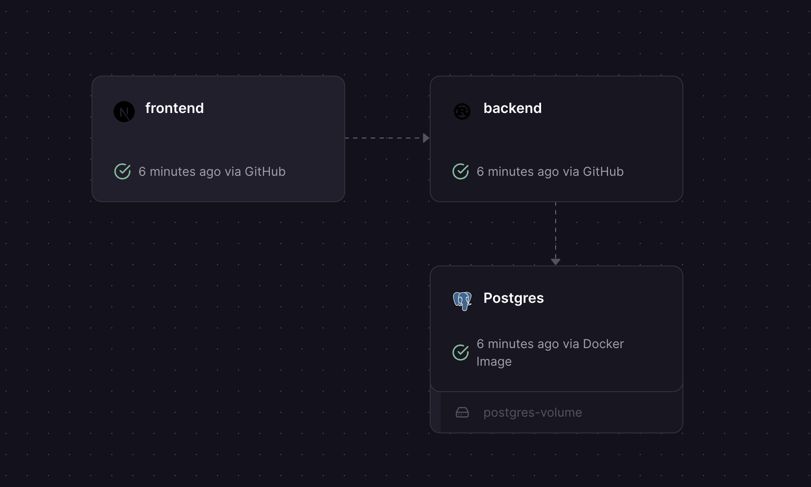

# Rust React Starter

A fullstack todo application built with Rust (Axum) and Next.js, demonstrating **end-to-end type safety**, **REST + WebSocket APIs**, **PostgreSQL with migrations**, **comprehensive testing infrastructure**, **reusable automation scripts**, and **production-ready CI/CD**.

Previously built an Axum-React template, but working on more projects helped me realize better patterns. This template incorporates those lessons learned as a practical reference implementation.

[](https://railway.com/deploy/rust-react-starter?referralCode=trevor)

https://github.com/user-attachments/assets/319f7be6-ba9a-4c6c-b415-df4abd9e7e91

## Project Structure

```
rust-react-starter/
├── apps/
│   ├── backend/              # Rust Axum API (REST + WebSocket)
│   └── frontend/             # Next.js app (React 19 + TypeScript)
└── packages/
    ├── shared/               # Generated OpenAPI schemas
    ├── sdk/                  # Auto-generated TypeScript SDK
    └── test-utils/           # Shared testing utilities (Rust + TypeScript)
```

## 🚀 Getting Started

### Prerequisites

- [Rust](https://rustup.rs/)
- [Bun](https://bun.sh/)
- [Docker](https://www.docker.com/)
- [just](https://github.com/casey/just)

### Quick Start

```bash
# 1. Setup everything (checks tools, installs deps, builds)
just setup

# 2. Start database and run migrations
just db

# 3. Start development servers
just backend   # Terminal 1: http://localhost:8888
just frontend  # Terminal 2: http://localhost:3000
```

**Application URLs:**

- Frontend: http://localhost:3000
- Backend API: http://localhost:8888
- API Docs: http://localhost:8888/api/docs
- WebSocket: ws://localhost:8888/ws

## 🏗️ Architecture

This template is a modern monorepo with a focus on end-to-end type safety, comprehensive testing infrastructure, reusable automation scripts, and production-ready CI/CD. It contains the following components:



| Layer        | Technology                             | Purpose                                                                                                                                                       |
| ------------ | -------------------------------------- | ------------------------------------------------------------------------------------------------------------------------------------------------------------- |
| **Frontend** | Next.js 15 + Zustand + Shadcn/ui       | Modern, fast UI. App router, server components, global state management                                                                                       |
| **Backend**  | Rust + Axum + OpenAPI + Schemars       | High-performance fully typed REST and WebSocket APIs                                                                                                          |
| **Database** | PostgreSQL + SQLx                      | Reliable data persistence with compile-time query verification                                                                                                |
| **Packages** | SDK + testcontainers                   | Clean SDK for frontend usage and testing utilities for integration tests                                                                                      |
| **Infra**    | Docker + Devcontainer + GitHub Actions | Containerized development environment and CI/CD pipeline + super easy [Railway deployment](https://railway.com/deploy/rust-react-starter?referralCode=trevor) |

## Development Commands

```bash
just                 # List all commands
just setup           # One-command setup
just db              # Start PostgreSQL + run migrations
just db-reset        # Reset database (destroys data)
just db-prepare      # Generate SQLx offline data
just types           # Regenerate OpenAPI + TypeScript types
just backend         # Start backend server
just frontend        # Start frontend dev server
just test            # Run all tests
just fmt             # Format all code
just lint            # Lint all code
just ci              # Run all CI checks
```

## License

MIT
